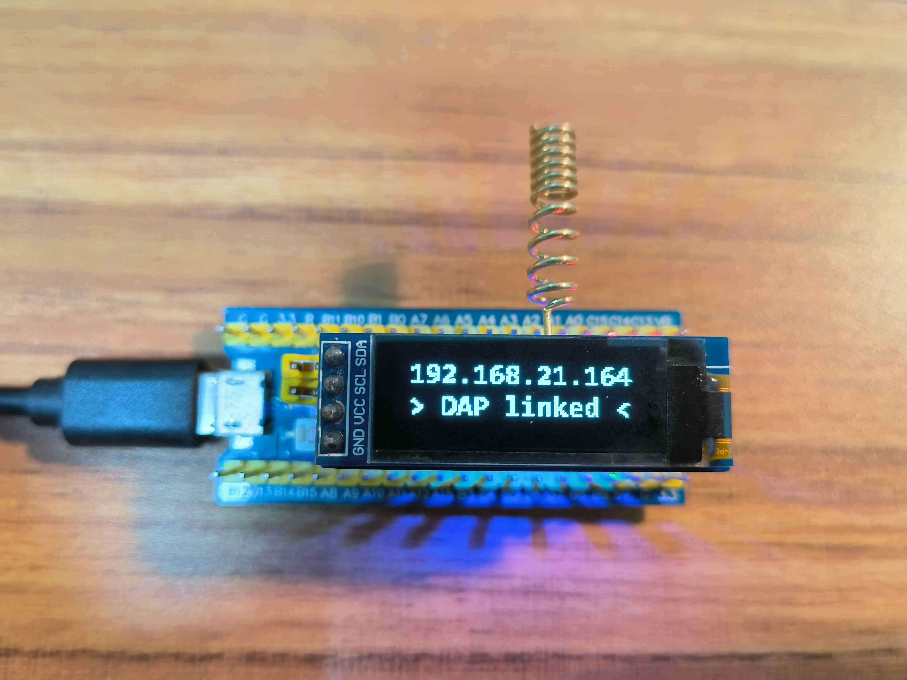

## ESP-01F 制作的无线 DAP 烧录探头

> 原项目开源地址：[https://github.com/windowsair/wireless-esp8266-dap](https://github.com/windowsair/wireless-esp8266-dap)

- 增加 0.91寸OLED显示屏
- 显示DAP连接状态、IP地址、SSID
- ESP-01F 2M 模块，PCB仅0.91寸OLED显示屏模块大小
- ！！！！！建议网络环境较好时使用，校园网的话。。。就直接绕道吧

已连接

背面

## License

[MIT LICENSE](LICENSE)
